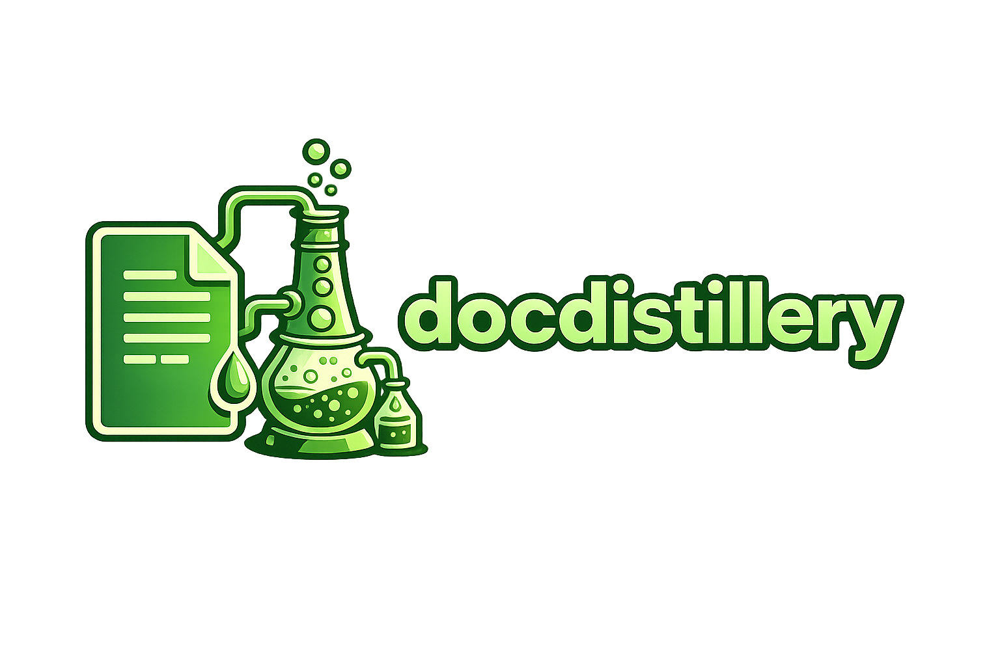

# DocDistillery

DocDistillery is a modular Python package designed to distill large documents and transform structured data (CSV) into coherent narratives. It leverages vector embeddings, clustering, and LLMs to provide intelligent summarization and insight extraction.

## Quickstart

### Installation

Run the unified setup script to install system dependencies (macOS/Linux) and the Python environment:

```bash
git clone https://github.com/bonhollow/docdistillery.git
cd docdistillery
./setup.sh
```

This will:
- Install `pango`, `cairo`, and `libffi` (on macOS via Homebrew) for PDF export.
- Create a virtual environment (`.venv`).
- Install the package in editable mode.

### Basic Command

Summarize a PDF and see the result in your terminal:

```bash
docdistillery summarize --input report.pdf --no-save
```

---

## CLI Usage

DocDistillery provides a unified CLI for end-to-end processing.

### 1. Ingest
Extract text or view raw data from supported formats (`.pdf`, `.docx`, `.txt`, `.csv`).
```bash
docdistillery ingest --input data/source.pdf
```

### 2. Index
Chunk and store document embeddings in a vector database.
```bash
docdistillery index --doc-id "report_001" --input source.txt --db-type memory
```

### 3. Summarize
Run the full summarization pipeline.
```bash
docdistillery summarize --input long_doc.pdf --strategy auto --format pdf --out summary.pdf
```
- **Strategies**: `sequential`, `clustered`, `auto` (auto switches to clustered for files > 50KB).
- **Formats**: `md`, `txt`, `json`, `docx`, `pdf`.

### 4. CSV to Narrative
Extract insights from tabular data and build a structured story.
```bash
docdistillery csv2story --input metrics.csv --tone executive --out insights.md
```
- **Tones**: `executive`, `didactic`, `technical`.

---

## Library Usage

DocDistillery can be imported as a library for custom pipelines.

```python
from pipeline import ingest, chunk_pages, synthesize, export_summary

# 1. Ingest and Chunk
data = ingest("document.pdf")
chunks = chunk_pages(data["pages"], doc_id="my_doc")

# 2. Synthesize with default BasicSummarizer (or plug in an LLM)
summary = synthesize(chunks)

# 3. Export
md_text = export_summary(summary, format="md")
print(md_text)
```

---

## Core Concepts

### Summarization Strategies

- **Sequential**: Processes chunks in document order. Best for short, linear narratives.
- **Clustered**: Uses HDBSCAN/K-Means to group similar information and selects representative chunks. Best for large, redundant documents.
- **Auto**: Heuristically selects the strategy based on document size and redundancy scores.

### Guarantees & Auditing

DocDistillery provides tools to verify information coverage:
- **Provenance**: Every summary object includes a mapping of sections back to the source `chunk_ids`.
- **Audit Mode**: Compares the summary provenance against all document clusters to identify "blind spots".
- **Guarantees**: We guarantee that the `provenance` field accurately reflects the source chunks used. We do **not** guarantee that an LLM will perfectly capture every nuance, but the `audit_report` flags clusters that were entirely omitted.

### LLM Options & Privacy

DocDistillery is LLM-agnostic:
- **Local**: Uses HuggingFace `transformers` (e.g., `google/flan-t5-small`). Data never leaves your machine.
- **Cloud**: Connects to OpenAI-compatible APIs. Requires `CLOUD_LLM_API_KEY`.
- **Privacy Warning**: Sending sensitive or proprietary documents to cloud LLMs may violate your data policy. Always prefer `LocalTransformersAdapter` for sensitive data.

### Output Options

- **File Formats**: Supports persistent export to Markdown, JSON, Plain Text, DOCX, and PDF.
- **No-Save Mode**: Use the `--no-save` flag in CLI to return the formatted string directly to `stdout`, useful for piping to other tools.

---

## Development

### Running Tests
All tests are deterministic and do not require external network calls.
```bash
pytest tests/pipeline/
```

### Linting & Formatting
We use `ruff` for fast static analysis and formatting.
```bash
ruff format .
ruff check . --fix
```

### CI/CD
A GitHub Actions workflow (`.github/workflows/ci.yml`) is configured to run lints and tests across Python 3.10, 3.11, and 3.12 on every push.
